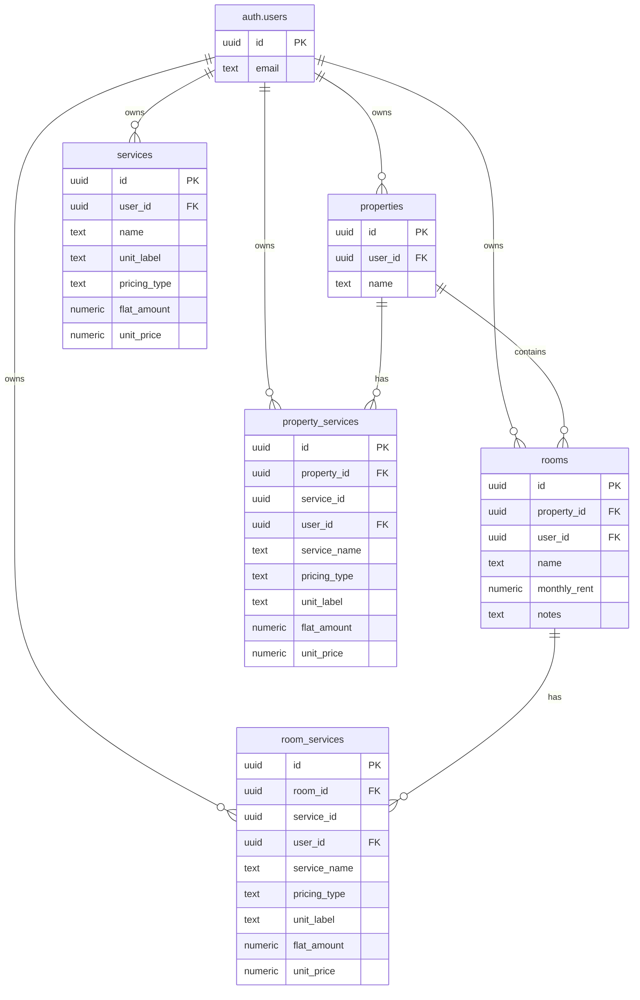

# Database Schema

This document outlines the database structure and relationships within Lumo.

## Entity Relationship Diagram

*Edit this diagram in the [Mermaid Live Editor](https://mermaid.live)*

## Tables

### `properties`

Stores information about properties managed by landlords.

| Key | Column | Type | Description |
| :--- | :--- | :--- | :--- |
| `PK` | `id` | `uuid` | Primary Key (Default: `gen_random_uuid()`) |
| `FK` | `user_id` | `uuid` | Foreign Key to `auth.users(id)`. |
| | `name` | `text` | The display name of the property. |

### `rooms`

Stores information about rooms within properties.

| Key | Column | Type | Description |
| :--- | :--- | :--- | :--- |
| `PK` | `id` | `uuid` | Primary Key (Default: `gen_random_uuid()`) |
| `FK` | `property_id` | `uuid` | Foreign Key to `properties(id)`. Cascades on delete. |
| `FK` | `user_id` | `uuid` | Foreign Key to `auth.users(id)`. |
| | `name` | `text` | The display name of the room. |
| | `monthly_rent` | `numeric` | Optional monthly rent amount for the room. |
| | `notes` | `text` | Optional additional notes about the room. |

### `services`

Stores the user-definable service catalog for service charges (electricity, water, wifi, etc.).

| Key | Column | Type | Description |
| :--- | :--- | :--- | :--- |
| `PK` | `id` | `uuid` | Primary Key (Default: `gen_random_uuid()`) |
| `FK` | `user_id` | `uuid` | Foreign Key to `auth.users(id)`. |
| | `name` | `text` | The display name of the service (e.g. "Electricity"). |
| | `unit_label` | `text` | Optional unit label for variable pricing (e.g. "kWh", "m³"). |
| | `pricing_type` | `text` | `'flat'` or `'variable'`. |
| | `flat_amount` | `numeric` | Optional flat monthly fee. Null until user sets a price. |
| | `unit_price` | `numeric` | Optional price per unit for variable services. Null until user sets a price. |

Two default services (Electricity kWh, Water m³) are auto-seeded for every new user via a trigger `on_auth_user_created_services` on `auth.users` insert.

### `property_services`

Stores property-level service configurations. Each row defines a service assigned to a property with its own name, pricing type, and amount. Services are self-contained per property — there is no FK dependency on the global `services` table. On room creation, entries from `property_services` pre-populate `room_services`.

| Key | Column | Type | Description |
| :--- | :--- | :--- | :--- |
| `PK` | `id` | `uuid` | Primary Key (Default: `gen_random_uuid()`) |
| `FK` | `property_id` | `uuid` | Foreign Key to `properties(id)`. Cascades on delete. |
| | `service_id` | `uuid` | UUID identifying the service type (no FK constraint). |
| `FK` | `user_id` | `uuid` | Foreign Key to `auth.users(id)`. |
| | `service_name` | `text` | The display name of the service (e.g. "Electricity"). |
| | `pricing_type` | `text` | `'flat'` or `'variable'`. |
| | `unit_label` | `text` | Optional unit label for variable pricing (e.g. "kWh", "m³"). |
| | `flat_amount` | `numeric` | Optional flat monthly fee. |
| | `unit_price` | `numeric` | Optional price per unit for variable services. |

Unique constraint on `(property_id, service_id)`.

### `room_services`

Stores room-level service configurations. Each row defines a service assigned to a room with its own name, pricing type, and amount. Services are self-contained per room — there is no FK dependency on the global `services` table. On room creation, entries from `property_services` pre-populate `room_services`.

| Key | Column | Type | Description |
| :--- | :--- | :--- | :--- |
| `PK` | `id` | `uuid` | Primary Key (Default: `gen_random_uuid()`) |
| `FK` | `room_id` | `uuid` | Foreign Key to `rooms(id)`. Cascades on delete. |
| | `service_id` | `uuid` | UUID identifying the service type (no FK constraint). |
| `FK` | `user_id` | `uuid` | Foreign Key to `auth.users(id)`. |
| | `service_name` | `text` | The display name of the service (e.g. "Electricity"). |
| | `pricing_type` | `text` | `'flat'` or `'variable'`. |
| | `unit_label` | `text` | Optional unit label for variable pricing (e.g. "kWh", "m³"). |
| | `flat_amount` | `numeric` | Optional flat monthly fee. |
| | `unit_price` | `numeric` | Optional price per unit for variable services. |

Unique constraint on `(room_id, service_id)`.

## Row Level Security (RLS)

All tables strictly enforce RLS policies to ensure user data isolation. Access is typically scoped to `auth.uid() = user_id`.

For more details on security, see the [Authentication Guide](./auth.md).
