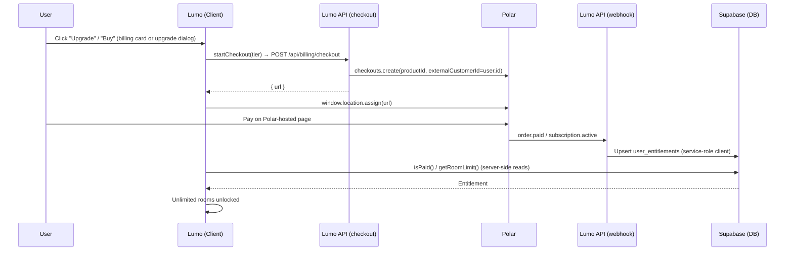

# Polar Payment Integration

Lumo uses **Polar** as its Merchant of Record for subscriptions and one-time payments. This guide covers the integration details and configuration specific to Lumo. For general information, refer to the [Official Polar Documentation](https://docs.polar.sh/).

---

## The Checkout Flow

*Edit this diagram in the [Mermaid Live Editor](https://mermaid.live)*



---

## Entitlement Model

`user_entitlements` is the **source of truth**. Polar webhooks upsert it via the service-role
client; the app only ever reads `isPaid(userId)` / `getRoomLimit(userId)` (`lib/entitlement.ts`).
The billing provider is an implementation detail, which is what makes a future Stripe migration
cheap (see below).

- Free tier = max **5 rooms** (no `user_entitlements` row = not paid).
- Any payment (monthly, yearly, lifetime) = **unlimited rooms**.
- Existing rooms are **never deleted**; lapsed subscriptions only block **new** room creates.
- The room cap is enforced for **signed-in users only** (local/offline users are unaffected).

| Status | Meaning | Unlimited rooms? |
|---|---|---|
| `active` | Subscription paid and in force. | Yes |
| `canceled` | Canceled at end of billing period — keeps access to the period already paid for. | Yes, until `current_period_end` |
| `revoked` | Access ends immediately — failed renewal, chargeback, or immediate cancel. | No |

`revoked` exists to distinguish a genuine cancellation (keep access until paid period ends) from an
immediate loss of access (don't let them keep adding rooms for free).

`isPaid()`: lifetime + active → always paid; monthly/yearly → paid while
`status != 'revoked' && current_period_end > now()`.

---

## Configuration Guidelines

### 1. Accounts & environments

One Polar account/org with **TWO environments** — sandbox (test) + production:

- **Sandbox dashboard** (`sandbox.polar.sh`) — its own products, API keys, webhooks. Test mode,
  use test card `4242 4242 4242 4242`.
- **Production dashboard** (`polar.sh`) — its own products, API keys, webhooks. Live mode.

Products, API keys, and webhooks are created **separately in each dashboard** — they are distinct
values, never shared or copied across environments. Your app picks a set per environment via env vars.

### 2. Products (create 3, per environment)

| Product | Type | Price |
|---|---|---|
| Monthly | recurring | $5 / month |
| Yearly | recurring | $48 / year |
| Lifetime | one-time | $79 |

There is **no free-tier product** in Polar. Free = no `user_entitlements` row = 5-room cap.
Free tier exists purely in app logic. From each product, copy its ID →
`POLAR_PRODUCT_ID_MONTHLY`, `POLAR_PRODUCT_ID_YEARLY`, `POLAR_PRODUCT_ID_LIFETIME`
(one set per environment).

### 3. API key (Settings → API Keys)

- **Name:** `lumo-server` (or `lumo-production`).
- **Scopes:** `products:read`, `orders:read`, `subscriptions:read`, `subscriptions:write`,
  `customers:read`, `customer_sessions:write`, `checkouts:write`.
  (`subscriptions:write` is required so a lifetime purchase can auto-cancel the customer's
  active subscriptions.)
- **Expiration:** longest available (custom/no-expiry preferred); it's server-side only, never in
  the browser, never `NEXT_PUBLIC_*`.
- → `POLAR_ACCESS_TOKEN` (one per environment).

### 4. Webhooks (Settings → Webhooks → Add Endpoint)

- URL: `https://lumo.homes/api/polar/webhook`. For local dev, run `polar listen http://localhost:3000/api/polar/webhook` — the full path is required, otherwise events hit the root route and are silently dropped (they return `200` without invoking the handler).
- Events to select (**do not select everything**):

| Group | Events |
|---|---|
| Order | `order.paid`, `order.refunded` |
| Subscription | `subscription.active`, `subscription.canceled`, `subscription.revoked`, `subscription.updated` |

- `subscription.updated` is the catch-all for `past_due`/`paused`/`resumed`/`cycled` — prevents a
  paused user from staying wrongly entitled.
- Skip: `benefit.*`, `checkout.*`, `customer.*`, `customer_seat.*`, `discount.*`, `member.*`,
  `organization.*`, `product.*`, `refund.*`, `subscription.created/cycled/past_due/uncanceled`,
  `order.created/updated`.
- → secret becomes `POLAR_WEBHOOK_SECRET` (one per environment).

### 5. Environment variables

Ensure these vary between your environment:
- **Local (`.env.local`)**: Uses your sandbox project values.
- **Production (Vercel)**: Uses your production project values.

```bash
POLAR_SERVER=sandbox|production
POLAR_ACCESS_TOKEN=...
POLAR_WEBHOOK_SECRET=...
POLAR_PRODUCT_ID_MONTHLY=...
POLAR_PRODUCT_ID_YEARLY=...
POLAR_PRODUCT_ID_LIFETIME=...
NEXT_PUBLIC_APP_URL=...
```

### 6. Production deployment checklist

Production uses the **separate production Polar environment** (`polar.sh`, live mode) — nothing is
shared with sandbox. Steps:

1. **Deploy the app first** so the endpoint exists (Vercel build, `npm run build`).
2. **Create the webhook in the production Polar dashboard** (Settings → Webhooks → Add Endpoint):
   - URL: `https://www.lumo.homes/api/polar/webhook` (must be HTTPS and publicly reachable).
   - Secret: generate one, save it — you can't view it again after creation.
   - Events: exactly the table above (`order.paid`, `order.refunded`, `subscription.active`,
     `subscription.canceled`, `subscription.revoked`, `subscription.updated`).
3. **Set production env vars** in the host (Vercel → Project → Settings → Environment
   Variables, Production scope), all from the **production** Polar dashboard:
   `POLAR_SERVER=production`, `POLAR_ACCESS_TOKEN`, `POLAR_WEBHOOK_SECRET`,
   `POLAR_PRODUCT_ID_MONTHLY/YEARLY/LIFETIME`, plus the existing Supabase prod credentials and
   `NEXT_PUBLIC_APP_URL=https://www.lumo.homes`.
4. **Verify the connection**: in the Polar production dashboard, open the webhook endpoint's
   "Recent Deliveries" and confirm a test event returns `200`. If it returns `403`, the
   `POLAR_WEBHOOK_SECRET` on the host doesn't match the endpoint's secret.
5. **Sanity check end-to-end**: make a test purchase with a real card (or a low-cost product),
   then confirm `user_entitlements` gains a row for that user (`tier`, `status`, `current_period_end`).

---

## Key Behaviors

### Entitlement refresh
Polar webhooks are the only writer to `user_entitlements`. `onOrderPaid` upserts a lifetime
entitlement; `onSubscriptionActive`/`onSubscriptionUpdated` upsert tier + `current_period_end`;
`onSubscriptionCanceled`/`onSubscriptionRevoked` mark the entitlement inactive. Upserts are
idempotent by `user_id`. The user is resolved via `customer.externalId` (= `user.id`); the tier is
resolved by comparing `productId` against the `POLAR_PRODUCT_ID_*` env vars.

### Plan switching & lifetime crossover
When a lifetime order lands, `handleOrderPaid` (`app/api/polar/webhook/route.ts`) upserts the
lifetime entitlement and then **revokes the customer's active subscriptions immediately**
(`cancelActiveSubscriptions`) so no further recurring charge is made. `handleSubscription` also
guards the entitlement: subscription events (renewals, cancellations) never downgrade an active
lifetime user back to a recurring tier. Whether Polar prorates or refunds any unused time on a
switch/crossover has **not been verified yet** — do not publish FAQ copy on it until confirmed
(see `docs/faq-pricing.md`).

### Customer portal
The settings page offers a customer portal (manage payment method, invoices, cancel/reactivate) via
`GET /api/billing/portal`, which opens the existing customer's Polar management dashboard. Checkout
(`POST /api/billing/checkout`) and portal both return a Polar URL and use the same redirect pattern,
but point at different Polar surfaces: checkout = pay, portal = manage.

### Where checkout is initiated
- **Settings billing card** (`components/dashboard/settings/billing-card.tsx`) — current plan,
  room usage, "Manage subscription" (portal), "Buy Lifetime".
- **Upgrade dialog** (`components/dashboard/billing/upgrade-dialog.tsx`) — shown when a free user
  hits the 5-room cap (the "+" button opens it instead of the add-room dialog).
- The **landing page** pricing cards link into the app (free → dashboard, paid tiers → settings);
  they do not start checkout directly.

---

## Structure

All billing logic is colocated by concern:
- `lib/polar.ts` — Polar SDK client (server-side only) + `getPolarProductId(tier)` /
  `tierFromProductId(productId)`.
- `lib/entitlement.ts` — `isPaid(userId)`, `getRoomLimit(userId)`.
- `app/api/billing/checkout/route.ts` — creates a Polar checkout session.
- `app/api/billing/portal/route.ts` — creates a Polar customer-session URL.
- `app/api/billing/status/route.ts` — entitlement status for the UI (`tier`, `isPaid`, limits).
- `app/api/polar/webhook/route.ts` — event ingestion, upserts entitlements via the service-role
  client (`lib/supabase-admin.ts`).
- `components/dashboard/billing/store.ts` — Zustand store (`startCheckout`, `startPortal`,
  `fetchStatus`, three-flag loading pattern).
- `components/dashboard/billing/upgrade-dialog.tsx` — tier picker (Monthly / Yearly / Lifetime).
- `components/dashboard/settings/billing-card.tsx` — current plan + actions.

---

## Future: Migration to Stripe

Switching from Polar to Stripe is cheap **because `user_entitlements` is the source of truth** and
the app only reads `isPaid(userId)` / `getRoomLimit(userId)`.

### Code changes (small, contained)

| Piece | Polar | Stripe |
|---|---|---|
| SDK + client | `lib/polar.ts` | `lib/stripe.ts` |
| Checkout | `billing/checkout` → Polar SDK | Stripe Checkout Session (`mode: subscription` for monthly/yearly, `mode: payment` for lifetime) |
| Manage portal | `billing/portal` → Polar session | Stripe Billing Portal |
| Webhook route | Polar events (`order.paid`, `subscription.*`) | Stripe events (`checkout.session.completed`, `customer.subscription.updated/deleted`) — different names/payload/signature verification |
| Env vars | `POLAR_*` | `STRIPE_*` price IDs |
| Tier mapping | product IDs | price IDs |

Roughly 3 route files rewritten + SDK swap. A day or two.

### What does NOT change

- `user_entitlements` table + `lib/entitlement.ts`.
- The 5-room cap in `POST /api/rooms`.
- Billing store, upgrade dialog, pricing page, settings card, and their tests.

### Hidden cost (business, not code)

- **Polar is a Merchant of Record** — handles tax, invoices, refunds, fraud.
- **Stripe is a processor** — you become the merchant of record and take on tax/invoice/refund
  liability (or pay for Stripe Tax as an add-on).

Keep Polar types contained in the webhook route + `lib/polar.ts` so this migration stays clean.
